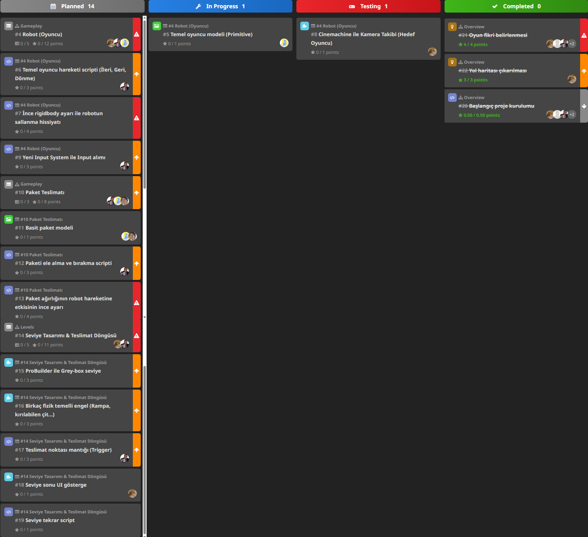
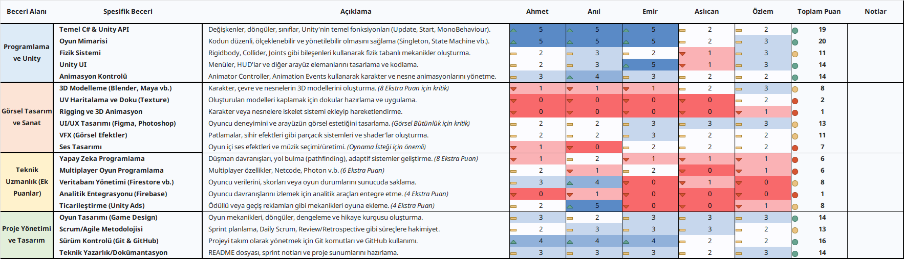
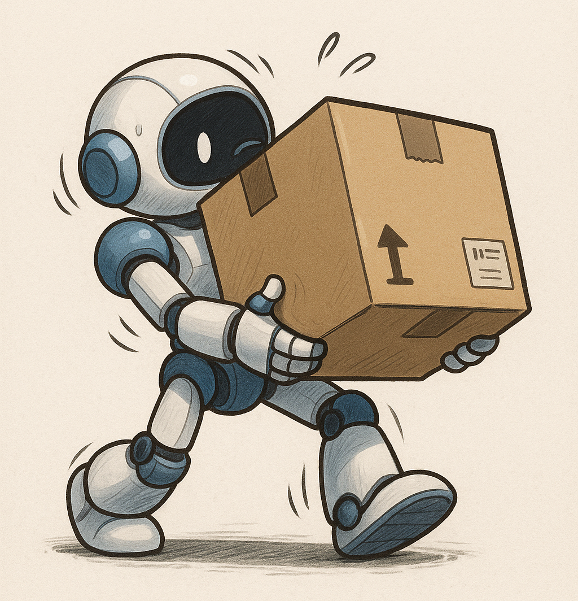

# Sprint 1

## Sprint Planlama & Sprint Süreci

### Sprint Notları

 - Bu sprintte takım birbiriyle kaynaştı, oyunun teması, oynanışı, neler içereceği belirlendi.
 - Oyunun prototipi de bu sprint için planlanmıştı ama finaller ve ekip içi kişisel nedenlerden dolayı planlanandan yavaş ilerlendi.
 - Planlanan puan 38.5 iken 7.5 puan tamamlandı.
 - Toplanan puanlar geliştirme sürecinden değil proje başlangıcından (Fikir, tasarım, kurulum) toplandı.
 - Prototip için 3 User Story'den 13 görev çıkarıldı.
   - Oyuncu olarak, fizik tabanlı eğlenceyi deneyimleyebilmek için sallantılı ve zorlu hissettiren bir robotu kontrol etmek istiyorum. (5 Görev, 12 puan)
   - Oyuncu olarak, bir teslimat yapabilmek için bir paketi alıp taşıyabilmek istiyorum. (3 Görev, 8 Puan)
   - Oyuncu olarak, basit bir seviye ve bir hedef istiyorum, böylece bir paketi alma ve teslim etme oyun döngüsünün tamamını test edebilirim. (5 Görev, 11 Puan)
 - Proje yönetimi HackNPlan üzerinden Kanban tahtası ile yapıldı.

### Tahmin Edilen Tamamlanacak Puan

38.5

### Tahmin Mantığı

Acil görevler 4 puan, yüksek öncelikliler 3 puan, normal öncelikliler 1 puan, düşük öncelikliler 0.5 puan olarak hesaplandı.

### Daily Scrum

Toplantılar Google Meet ile yapıldı, ayrıca Whatsapp üzerinden takım içi iletişim kuruldu.

[Whatsapp Konuşmaları](WHATSAPP_TALKS.md)

### Sprint Board Updates

## Sprint Değerlendirme & Sprint Retrospektifi

### Ekran Görüntüleri

Beceri Matrisi ile takımın yeteneklerine uygun proje seçildi.

---

Referans görseller ile oyuncunun (robot) modellemesine başlandı.

---

Oyun oluşturulmaya daha başlanmadığı için Unity'den ekran görüntüsü yok.

### Sprint Review

 - Takım olarak oyunun teması, mekanikleri ve tarzı hakkında fikir birliği sağlandı, yardımcı fikirler şu anlık elendi.
 - Sprint Review Katılımcıları
   - Emir Beşir, Ahmet Hakan Çetinkaya, Anıl Cengiz, Özlem Göksun, Aslıcan Öztürk

### Sprint Retrospective

 - Tasarım ve Kodlama ekibi olarak ikiye bölünüldü.
   - Kodlama: Emir, Anıl ve Hakan
   - Tasarım: Aslıcan ve Özlem
 - Takım üyelerinin gelecek sprintlerde daha fazla aktif olması gerektiğine vurgu yapılmıştır.

