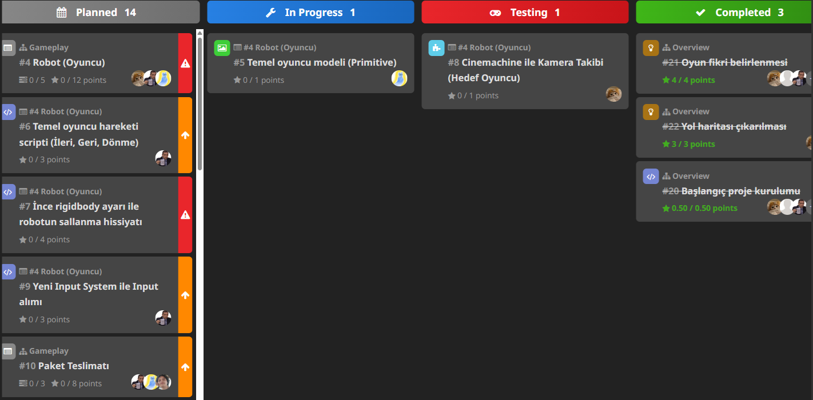

# Sprint 1

## Sprint Planlama & Sprint Süreci

### Sprint Notları

Fikrin belirlendiği ve yol haritasının çizildiği bir sprint oldu. Oyunun prototipi bir sonraki sprinte aktarıldı.

### Tahmin Edilen Tamamlanacak Puan

38.5

### Tahmin Mantığı

Acil görevler 4 puan, yüksek öncelikliler 3 puan, normal öncelikliler 1 puan, düşük öncelikliler 0.5 puan olarak hesaplandı.

### Daily Scrum

Toplantılar Google Meet ile yapıldı

### Sprint Board Updates

## Sprint Değerlendirme & Sprint Retrospektifi

### Ekran Görüntüleri

Oyun oluşturulmaya daha başlanmadığı için oyundan ekran görüntüsü yok.

### Sprint Değerlendirmesi

Takım olarak oyunun teması, mekanikleri ve tarzı hakkında fikir birliği sağlandı, sonraki sprintlerin de planı yapıldı.

### Sprint Retrospektifi

 - Tasarım ve Kodlama ekibi olarak ikiye bölünüldü.
   - Kodlama: Emir, Anıl ve Hakan
   - Tasarım: Aslıcan ve Özlem
