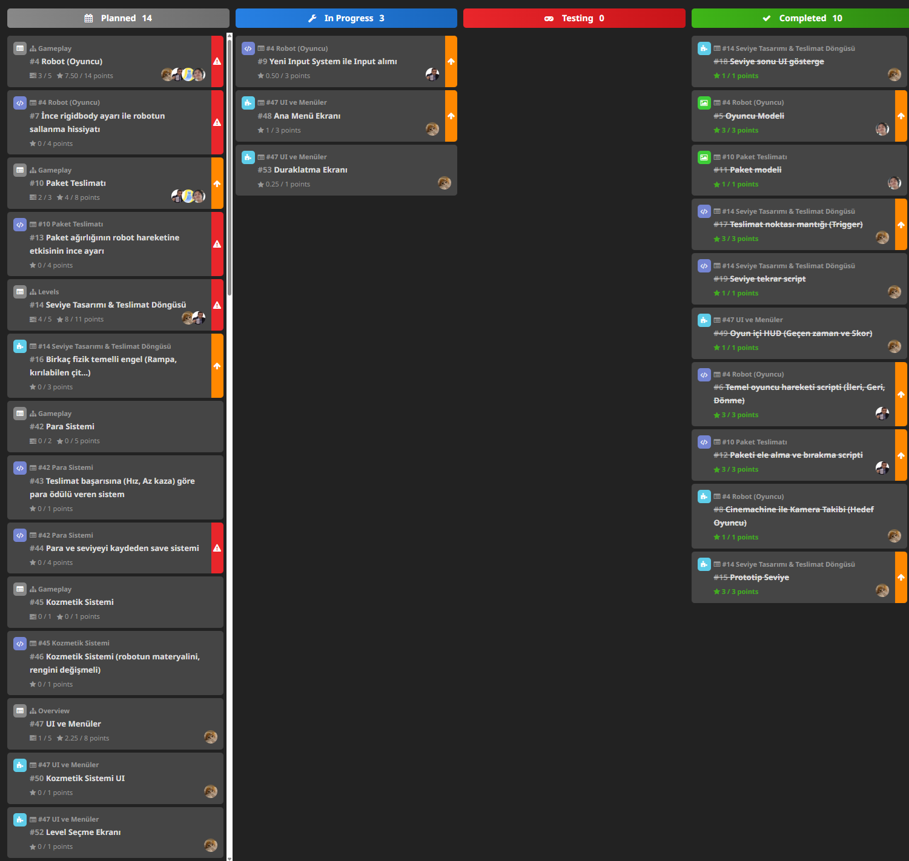

# Sprint 2

## Sprint Planlama & Sprint Süreci

### Sprint Notları

 - Bu sprintte oyunun yarım bir prototipi tamamlandı.
 - Sprintin ilk haftası prototipin bitmesi, ikinci hafta content eklenmesi planlanmıştı.
 - Planlanan puan 47 iken 22.75 puan tamamlandı.
 - Prototip için ilk sprintteki 3 User Story biraz revize edildi ve yeni 3 User Story'den toplam 21 görev çıkarıldı.
    - 21 görevden 10 tanesi tamamlandı, bunlar ağırlıklı olarak ilk sprintte planlanan görevlerdi.
    - İlk Sprint User Storyler
        - Oyuncu olarak, fizik tabanlı eğlenceyi deneyimleyebilmek için sallantılı ve zorlu hissettiren bir robotu kontrol etmek istiyorum. (5 Görev, 14 puan)
        - Oyuncu olarak, bir teslimat yapabilmek için bir paketi alıp taşıyabilmek istiyorum. (3 Görev, 8 Puan)
        - Oyuncu olarak, basit bir seviye ve bir hedef istiyorum, böylece bir paketi alma ve teslim etme oyun döngüsünün tamamını test edebilirim. (5 Görev, 11 Puan)
    - Bu Sprinte özel User Storyler
        - Oyuncu olarak, başarılı teslimatlar için para kazanmak istiyorum, böylece bir ilerleme ve ödül duygusu hissediyorum. (2 Görev, 5 Puan)
        - Oyuncu olarak, para birimimi kozmetik ve küçük oyun yükseltmelerine harcamak istiyorum, böylece deneyimimi özelleştirebiliyorum. (1 Görev, 1 Puan)
        - Oyuncu olarak, oyunda gezinmek ve ilerlememi takip etmek için net ve işlevsel bir kullanıcı arayüzü istiyorum. (5 Görev, 8 Puan)
 - Proje yönetimi HackNPlan üzerinden Kanban tahtası ile yapıldı.

### Tahmin Edilen Tamamlanacak Puan

47

### Tahmin Mantığı

Acil görevler 4 puan, yüksek öncelikliler 3 puan, normal öncelikliler 1 puan, düşük öncelikliler 0.5 puan olarak hesaplandı.

### Daily Scrum

Toplantılar Google Meet ile yapıldı, ayrıca Whatsapp üzerinden takım içi iletişim kuruldu.

[Whatsapp Konuşmaları](WHATSAPP_TALKS.md)

### Sprint Board Updates

## Sprint Değerlendirme & Sprint Retrospektifi

### Ekran Görüntüleri

[Geliştirme Ekran Görüntüleri](DEVELOPMENT_SCREENSHOTS.md)

### Sprint Review

  - Son sprinte girerken beklenenden daha az iş yapılmasıyla öncelikler netleştirildi.
  - Sprint Review Katılımcıları
    - Emir Beşir

### Sprint Retrospective

  - Takım içi iletişim ve toplantılar beklenenden daha az aktif gerçekleşti, Google Meet ve Whatsapp yeterince kullanılmadı.