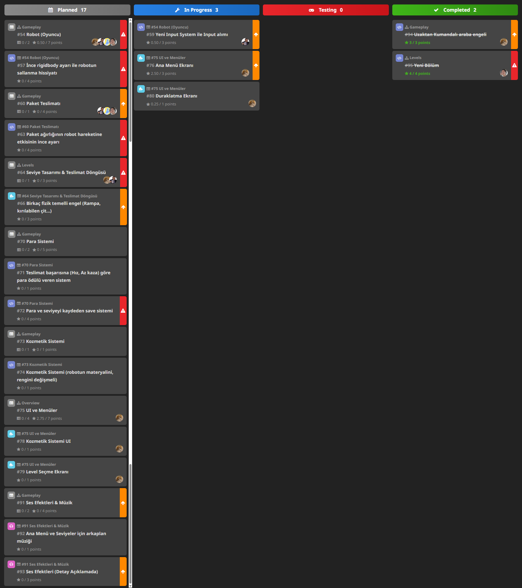

# Sprint 3

## Sprint Planlama & Sprint Süreci

### Sprint Notları

- Bu sprintte takım üyeleri çok az miktarda aktifti ve planlanan görevlerin çoğu tamamlanamadı.
- Planlanan puan 34.25 iken sadece 8.5 puan tamamlandı.

### Tahmin Edilen Tamamlanacak Puan

34.25

### Tahmin Mantığı

Acil görevler 4 puan, yüksek öncelikliler 3 puan, normal öncelikliler 1 puan, düşük öncelikliler 0.5 puan olarak hesaplandı.

### Daily Scrum

Toplantılar düzenli olarak yapılamadı. Whatsapp'ta da iletişim çok azdı.

[Whatsapp Konuşmaları](WHATSAPP_TALKS.md)

### Sprint Board Updates

## Sprint Değerlendirme & Sprint Retrospektifi

### Ekran Görüntüleri

[Geliştirme Ekran Görüntüleri](DEVELOPMENT_SCREENSHOTS.md)

### Sprint Review

- Yapılmadı

### Sprint Retrospective

- Yapılmadı
